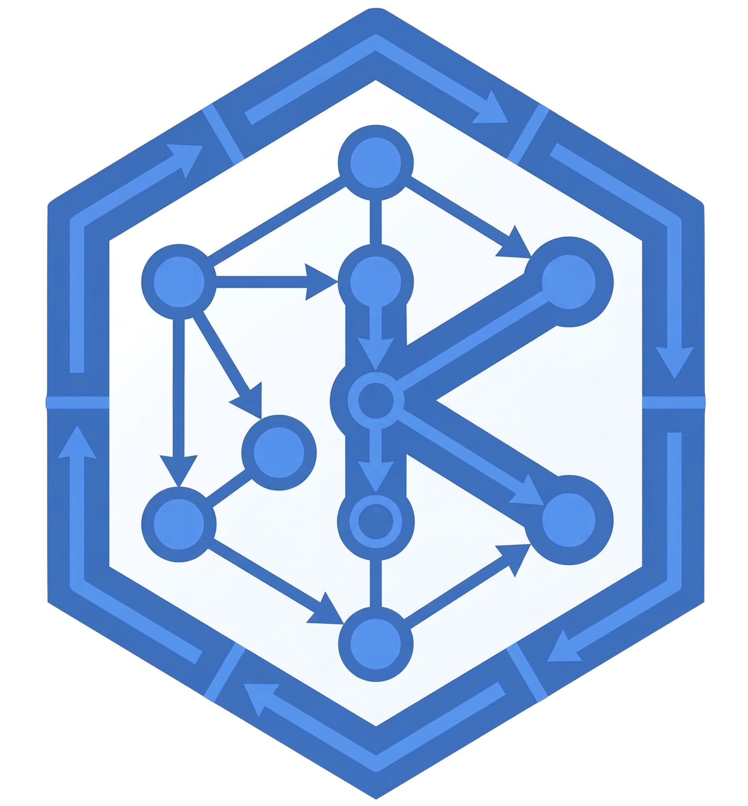

 

# kro-ui   

[](https://github.com/pnz1990/kro-ui/actions/workflows/ci.yml)
[](https://github.com/pnz1990/kro-ui/actions/workflows/codeql.yml)
[](https://github.com/pnz1990/kro-ui/releases)

A read-only web dashboard for [kro](https://kro.run) — visualize ResourceGraphDefinitions, inspect live instances, explore your resource graphs, and understand RBAC gaps directly from the cluster.

> Unofficial. Out-of-tree. Built for velocity. Path to kro org adoption when stable.

## Features

- **Overview page** (`/`) — operational health dashboard: RGD card grid with status dots, kind badges, resource count, age, health chips, controller metrics strip, terminating badges, debounced search, and error count badges; virtualized for 5,000+ RGDs
- **Catalog page** (`/catalog`) — browsable RGD directory with search, label filter, sort controls, per-RGD instance counts, "Used by" chaining rows, and forEach collapse suggestions (optimization advisor)
- **RGD static chaining graph** — detect and visualize chained RGD relationships; expand parent/child chains without a live cluster
- **RGD detail** — seven tabs: Graph · Instances · Errors · YAML · Validation · Access · Docs · Generate
  - **Graph tab** — interactive DAG with all managed resources, forEach collections, external refs, and `includeWhen` conditions; `readyWhen` CEL expressions and `forEach` cardinality badges on hover; instance overlay selector to visualize which nodes are active for a specific CR; "refreshed X ago" indicator
  - **Instances tab** — table of all CR instances with namespace filter, 5-state health badges (Ready/Reconciling/Degraded/Error/Terminating), fully-clickable rows, "show only errored" filter, and links to live detail
  - **Errors tab** — cross-instance error aggregation: failures grouped by resource node with affected instance count, percentage, most common error message, and drill-down to individual instances
  - **YAML tab** — syntax-highlighted RGD manifest with CEL expression highlighting and copy-to-clipboard
  - **Validation tab** — RGD condition checklist (GraphVerified, CRD synced, Topology ready) with resource type summary and CEL cross-reference map
  - **Access tab** — RBAC permission matrix for kro's auto-detected service account (runtime-discovered from the kro controller Deployment) against all managed resources, with kubectl fix suggestions and manual SA override form
  - **Docs tab** — auto-generated API documentation from the RGD schema: field types, defaults, CEL status expressions, custom type definitions (kro v0.9.0+ `spec.schema.types`), and a copyable example manifest
  - **Generate tab** — two-mode YAML generator: interactive instance form (per-field controls with type coercion) and batch mode (one line = one manifest); link to RGD Designer for new RGD authoring
- **Live instance detail** — live DAG with 5s polling, per-node state colors (alive/reconciling/error/pending/not-found), node YAML inspection, spec/conditions/events/telemetry panels
  - Per-node state derived from each child resource's own `status.conditions` — not just the root CR; `includeWhen`-excluded nodes shown in violet (pending), not-yet-created in gray (not-found)
  - Hover tooltip shows live state label for every node
  - **Telemetry panel** — per-instance age, state duration, child resource health table, and reconcile health indicators
  - **Deletion debugger** — when an instance has a `deletionTimestamp`, surfaces a Terminating banner showing elapsed time, active finalizers (with controller ownership), blocking child resources, and deletion-related events
  - **forEach collection explorer** — drill into collection fan-outs with per-item health badges, cardinality badge (`N/M`), and individual resource YAML
  - **Deep graph** — recursively expand chained RGD instances up to 4 levels deep, revealing the full composed resource tree
- **Instance health roll-up** — 5-state health badges (Ready/Reconciling/Pending/Error/Unknown) on all instance list rows and RGD cards; error count badges on home and catalog cards
- **RGD Designer** (`/author`) — first-class nav section alongside Overview/Catalog/Fleet/Events; full kro feature coverage: all 5 node types (Managed resource, forEach collection, External ref, External ref collection, Root CR), `includeWhen` conditions, `readyWhen` CEL, schema field editor with type/default/enum/min/max; live DAG preview (updates within 300ms, client-side only); Home and Catalog empty states link directly to it
- **Events** — kro-filtered Kubernetes event stream with anomaly detection (stuck reconciliation, error bursts), deletion event tagging, grouping by instance, and URL-param pre-filtering
- **Fleet overview** — multi-cluster view across all kubeconfig contexts: health status, RGD/instance counts, cross-cluster RGD presence matrix with abbreviated ARN context labels, and per-cluster kro controller metrics column
- **Controller metrics panel** — kro controller metrics auto-discovered via pod proxy (zero configuration); per-context correct after context switch; powers Fleet metrics column via `?context=` fan-out
- **Context switcher** — switch kubeconfig contexts at runtime without restart
- **CEL/schema highlighting** — custom pure-TS tokenizer for kro YAML (CEL expressions, kro keywords, SimpleSchema types)
- **Capabilities detection** — auto-detects kro features via cluster introspection, gates UI accordingly; kro v0.9.0+ features: `GraphRevision` API, cluster-scoped RGD badges, custom type definitions
- **First-time onboarding** — Overview page tagline, descriptive empty state with getting-started kubectl snippets, global footer with kro.run and GitHub links, and live version display
- **Dark/light theme** — dark default, full design token system, SVG favicon

## Quickstart

### Binary

```bash
# Build from source
make build
./bin/kro-ui serve

# With flags
./bin/kro-ui serve --port 9000 --kubeconfig ~/.kube/config --context staging
```

Download pre-built binaries from [Releases](https://github.com/pnz1990/kro-ui/releases).

### Docker

> **Pinned to the latest release** — update this tag on every new release.

```bash
docker run -p 40107:40107 \
  -v ~/.kube/config:/home/nonroot/.kube/config:ro \
  ghcr.io/pnz1990/kro-ui:v0.4.8
# open http://localhost:40107
```

**EKS clusters** use the `aws` exec credential plugin. Mount your AWS config and
set the profile:

```bash
docker run -p 40107:40107 \
  -v ~/.kube/config:/home/nonroot/.kube/config:ro \
  -v ~/.aws:/home/nonroot/.aws:ro \
  -e AWS_PROFILE=<your-aws-profile> \
  ghcr.io/pnz1990/kro-ui:v0.4.8
# open http://localhost:40107
```

**Controller metrics** are now auto-discovered via pod proxy — no `--metrics-url` flag required. kro-ui finds the kro controller pod automatically using label selectors and proxies through the kube-apiserver.

### In-cluster (Helm)

> **Pinned to the latest release** — update this version on every new release.

```bash
helm upgrade --install kro-ui oci://ghcr.io/pnz1990/kro-ui/charts/kro-ui \
  --version 0.4.8 \
  --namespace kro-system --create-namespace

kubectl port-forward svc/kro-ui 40107:40107 -n kro-system
# open http://localhost:40107
```

## API

All endpoints are read-only. No mutating k8s API calls are ever issued.

| Endpoint | Method | Description |
|----------|--------|-------------|
| `/api/v1/healthz` | GET | Health check (no cluster I/O) |
| `/api/v1/version` | GET | Build-time version info (version, commit, buildDate) |
| `/api/v1/contexts` | GET | List kubeconfig contexts + active |
| `/api/v1/contexts/switch` | POST | Switch active context |
| `/api/v1/rgds` | GET | List all RGDs |
| `/api/v1/rgds/{name}` | GET | Get single RGD |
| `/api/v1/rgds/{name}/instances` | GET | List instances of an RGD |
| `/api/v1/rgds/{name}/access` | GET | RBAC permission check for kro's service account (`?saNamespace=&saName=` for manual override) |
| `/api/v1/instances/{ns}/{name}` | GET | Get instance detail |
| `/api/v1/instances/{ns}/{name}/events` | GET | Instance events |
| `/api/v1/instances/{ns}/{name}/children` | GET | Instance child resources |
| `/api/v1/resources/{ns}/{group}/{ver}/{kind}/{name}` | GET | Raw resource YAML |
| `/api/v1/kro/capabilities` | GET | Detected kro capabilities and feature gates |
| `/api/v1/kro/metrics` | GET | kro controller metrics auto-discovered via pod proxy; `?context=<name>` for per-cluster Fleet fan-out |
| `/api/v1/kro/graph-revisions` | GET | List GraphRevision objects for an RGD (`?rgd=<name>`); requires kro v0.9.0+, returns `{items:[]}` on older clusters |
| `/api/v1/kro/graph-revisions/{name}` | GET | Get a single GraphRevision by Kubernetes name; requires kro v0.9.0+ |
| `/api/v1/events` | GET | kro-filtered Kubernetes events (`?namespace=`, `?rgd=`) |
| `/api/v1/fleet/summary` | GET | Multi-cluster summary across all kubeconfig contexts |

## Development

**Requirements:** Go 1.25+, Bun 1.3+

```bash
# 1. Install frontend deps and build
make web

# 2. Start Go server (reads web/dist)
make run

# 3. In a separate terminal — frontend hot-reload with proxy to Go server
make dev-web
```

The Go server runs on `:40107`. The Vite dev server proxies `/api/*` to it.

**Note:** `proxy.golang.org` is blocked in this environment. The Makefile
handles this automatically. If running `go` commands directly, use:
```bash
GOPROXY=direct GONOSUMDB="*" go ...
```

## Testing

```bash
# Go unit tests (with race detector)
GOPROXY=direct GONOSUMDB="*" go test -race ./...

# Frontend unit tests
cd web && bun run test

# TypeScript strict mode check
cd web && bun run typecheck

# E2E tests (requires kind, helm, kubectl)
make test-e2e-install   # one-time: install Playwright + Chromium
make test-e2e           # full run (creates kind cluster, runs tests, teardown)
```

E2E tests auto-detect the latest kro release and install it via Helm from
`registry.k8s.io/kro/charts/kro`. Override with `KRO_CHART_VERSION=0.8.5`.

## CI & Security

All PRs run through these checks before merge:

| Check | What |
|-------|------|
| **build** | `go vet` → `go test -race` → `go build` → `bun typecheck` |
| **govulncheck** | Go vulnerability scanner (fails on third-party dep vulns) |
| **trivy** | Docker image scan for CRITICAL/HIGH CVEs |
| **CodeQL** | Static analysis for Go + JS/TS (security-extended queries) |
| **Dependabot** | Weekly dependency scans for Go, npm, and GitHub Actions |

Branch protection enforces: 1 approving review, all required checks green,
CODEOWNERS review, linear history, no force push.

See [SECURITY.md](SECURITY.md) for vulnerability reporting.

## Architecture

```
cmd/kro-ui/         # Binary entrypoint (cobra)
internal/
  cmd/              # CLI commands (serve, version)
  server/           # HTTP server, chi router, SPA fallback
  api/handlers/     # Route handlers — thin layer over k8s package
  api/types/        # Shared API response types
  k8s/              # Dynamic client, discovery, RBAC, fleet helpers
  version/          # Build-time version info (set via ldflags)
web/
  embed.go          # go:embed frontend FS
  src/
    components/     # 40+ components: DAGGraph, LiveDAG, DeepDAG, KroCodeBlock, ...
    pages/          # Home, Catalog, Fleet, RGDDetail, InstanceDetail, Events
    lib/            # api.ts, dag.ts, highlighter.ts, schema.ts, events.ts, ...
    hooks/          # usePolling (5s refresh), useCapabilities
helm/kro-ui/        # Helm chart for in-cluster deployment
test/e2e/           # Playwright E2E journeys + kind cluster infra
Dockerfile          # Multi-stage: bun → go → distroless (~15MB)
```

**Key design decisions:**
- All k8s access via the **dynamic client** — no hardcoded type assumptions, survives kro API changes
- **Discovery-based** resource resolution — new kro CRDs are picked up automatically
- Frontend is **embedded** in the Go binary via `go:embed` — single binary, no file server config
- **Read-only** — never issues mutating k8s API calls; Helm RBAC enforces `get`/`list`/`watch` only
- **No CSS frameworks, no component libraries, no state management libraries** — plain CSS with design tokens, plain React state

## Port

`40107` — letters D(4), A(01), G(07) → DAG.

## License

Apache 2.0
